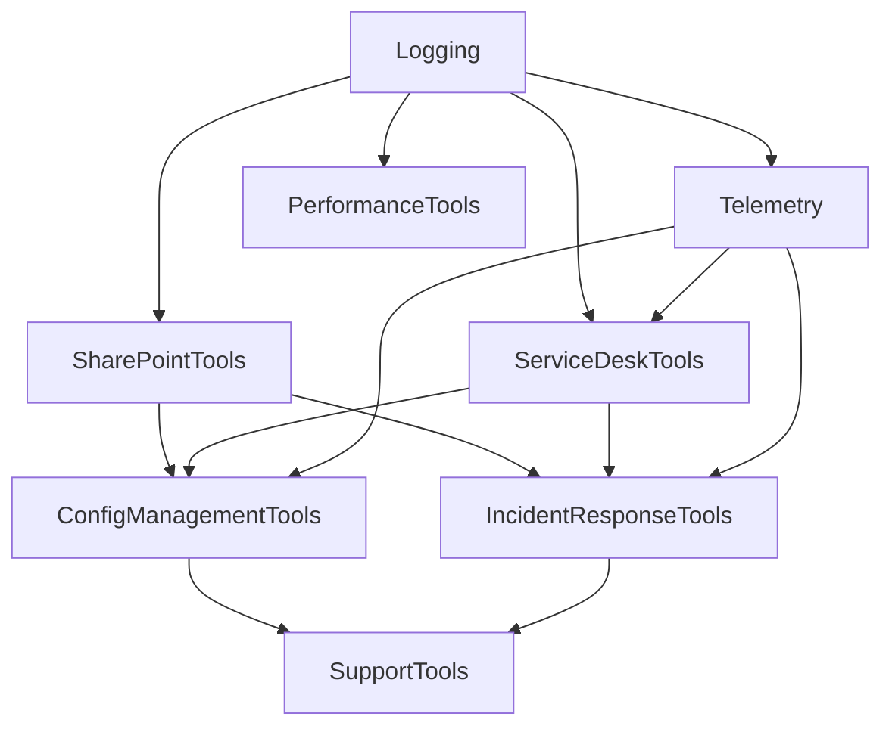

# Documentation Overview

This folder contains usage guides for the PowerShell modules and commands provided in this repository. Each Markdown file describes a single function or provides general guidance. When in doubt, run `Get-Help <Command>` in PowerShell to see the inline help that matches these documents.

The key guides are:

- [Quickstart](./Quickstart.md) – short steps to install the modules and run common commands.
- [User Guide](./UserGuide.md) – detailed deployment information and security notes.
 - [SupportTools](./SupportTools.md), [SharePointTools](./SharePointTools.md), [ServiceDeskTools](./ServiceDeskTools.md), [MonitoringTools](./MonitoringTools.md), [ChaosTools](./ChaosTools.md) – high level summaries of each module and the commands they expose.
- [Credential Storage](./CredentialStorage.md) – recommended approach to store secrets securely.
- [Module Style Guide](./ModuleStyleGuide.md) – how scripts display progress messages and log output.
- [PerformanceTools](./PerformanceTools.md) – measure execution time and resource usage.
- [Invoke-PerformanceAudit](./PerformanceTools/Invoke-PerformanceAudit.md) – collect system metrics and optionally create a Service Desk ticket.
- [Telemetry Metrics](./Telemetry/Get-STTelemetryMetrics.md) – summarize execution statistics and output to CSV or SQLite.
- [Get-FunctionDependencyGraph](./Get-FunctionDependencyGraph.md) – generate a visual map of function calls in a script.
- [Local Mock API](./LocalMockApi.md) – run a lightweight HTTP server for offline tests.
- [Testing Guidelines](./TestingGuidelines.md) – conventions for writing robust Pester tests.
- [Stewardship](./Stewardship.md) – how to maintain and hand off the project.
- [Roadmap](./Roadmap.md) – upcoming features and goals.

Command specific help topics live in the `SupportTools`, `SharePointTools` and `ServiceDeskTools` subfolders.

## Module Dependency Overview

Most modules build on a few shared components. `Logging` is the base layer for consistent output and is imported by nearly every module. The `Telemetry` module records usage metrics and depends on `Logging`. `STCore` provides common utility functions consumed across the toolkit.

Higher level modules such as `SharePointTools` and `ServiceDeskTools` load these core modules to perform their work. Modules like `ConfigManagementTools` and `IncidentResponseTools` combine features from both `SharePointTools` and `ServiceDeskTools`, while also using `Telemetry` for metrics. The `SupportTools` module aggregates the entire collection and exposes the top level commands.

This diagram is a simplified view but highlights how foundational modules feed into higher level functionality.

